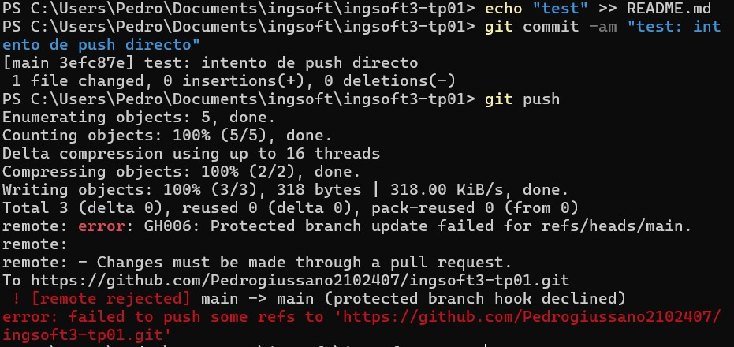
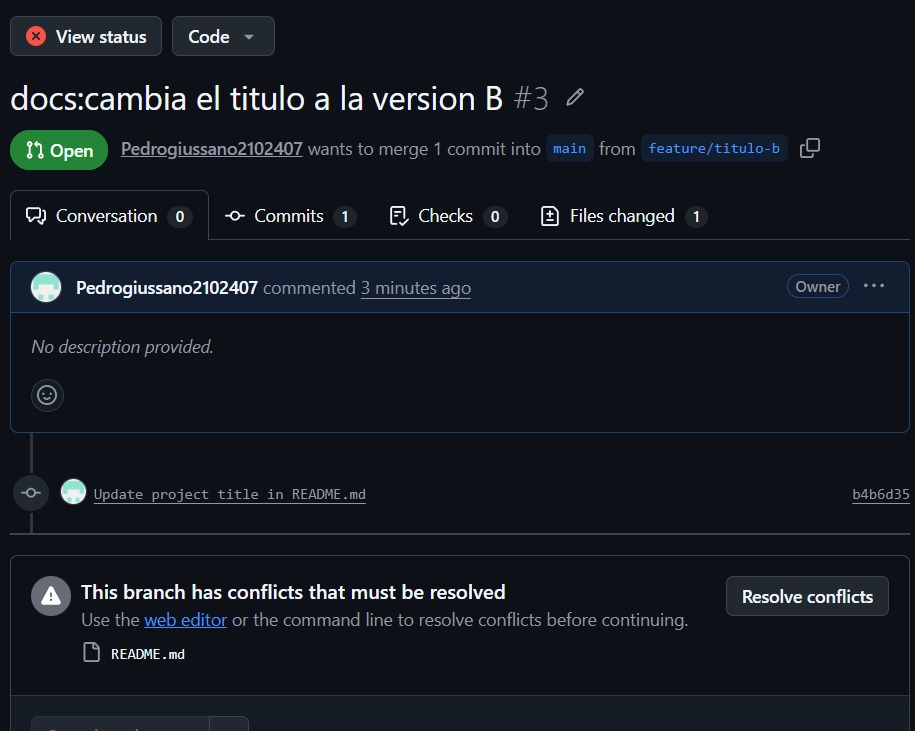
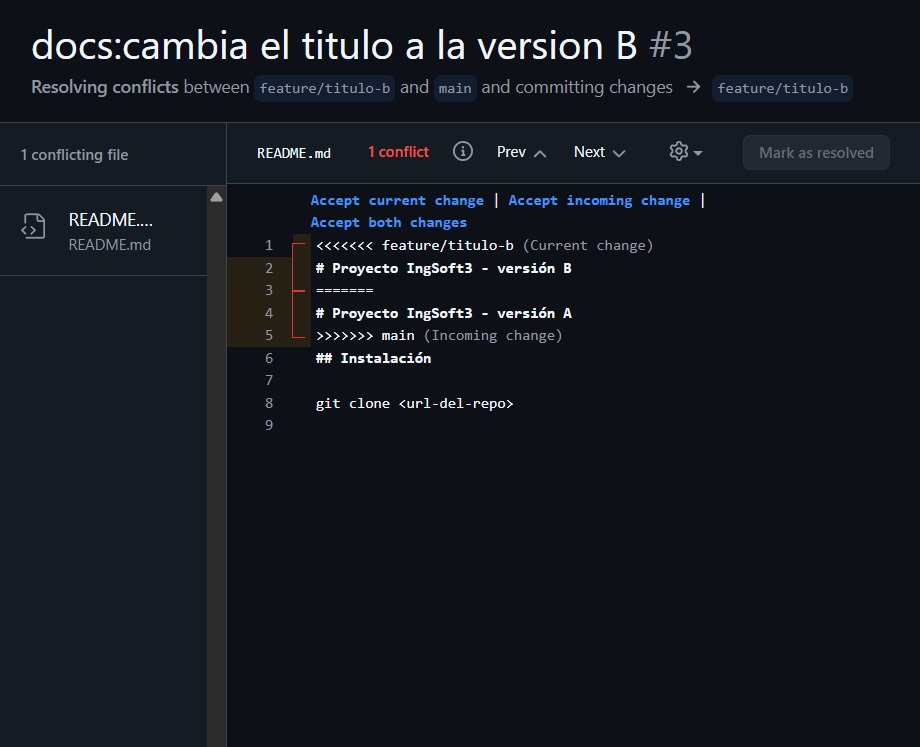
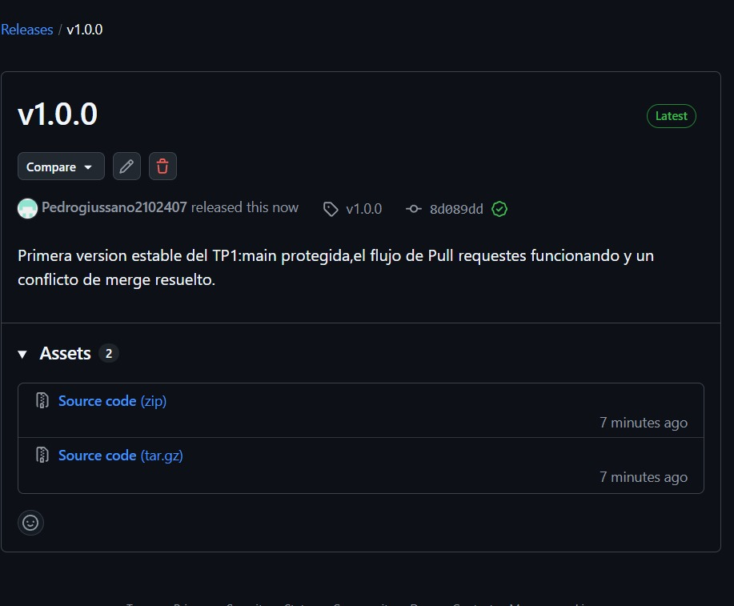
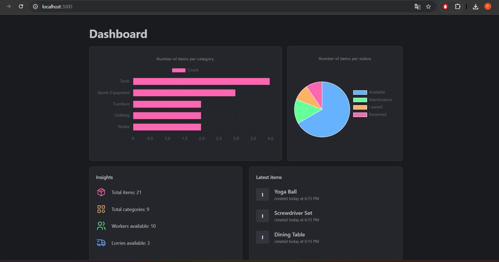
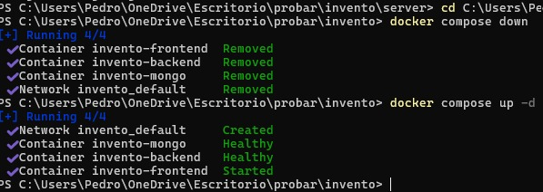
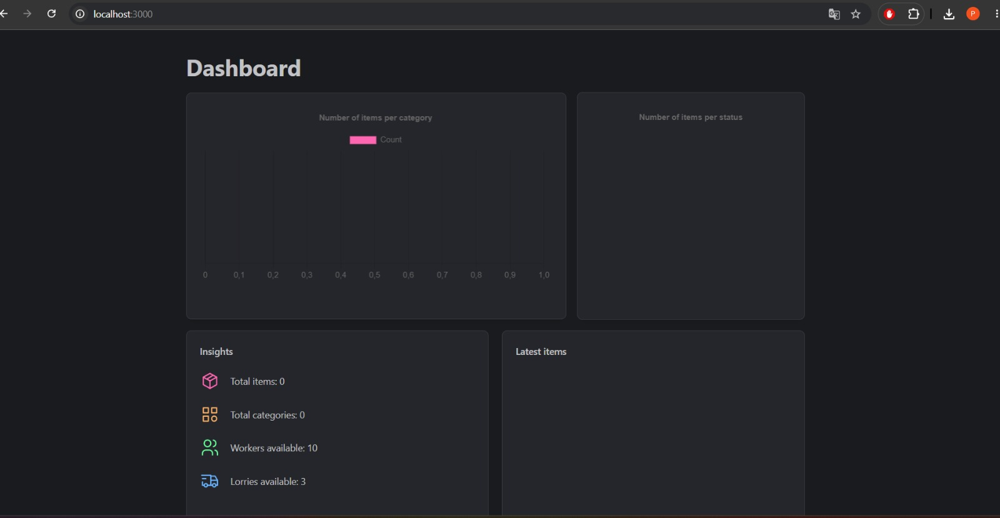
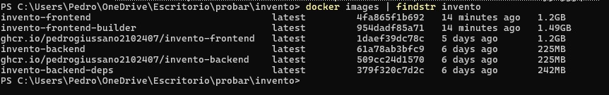

# Evidencias — TP1

## 1. Push directo a main rechazado

GitHub rechaza el push directo a `main` con el error "protected branch hook declined", 
confirmando que la protección de rama funciona incluso para el administrador del repositorio.

## 2. Aviso de conflicto en el PR

El Pull Request de la rama `feature/titulo-b` no se puede mergear automáticamente porque 
modifica la misma línea que ya fue mergeada desde `feature/titulo-a`.

## 3. Marcadores del conflicto

Vista del editor de resolución de conflictos de GitHub, mostrando los marcadores 
`<<<<<<<`, `=======` y `>>>>>>>` que delimitan las dos versiones en disputa antes de resolver.

## 4. Release v1.0.0 publicada

Página de la release `v1.0.0`, publicada sobre el tag del mismo nombre, con las notas 
describiendo qué incluye esta versión.

***************************************************************************************************************************************

## TP2 — Contenedores

### 1. Sistema funcionando end-to-end

El dashboard cargando datos reales (21 items, 9 categorías) desde MongoDB corriendo en un
contenedor local, con los tres servicios (mongo, backend, frontend) levantados con
docker compose up.

### 2. Prueba de persistencia

La primera captura muestra docker compose down seguido de up -d: los tres contenedores se
recrean y backend/mongo quedan en estado Healthy antes de que arranque el frontend, con los
datos intactos gracias al volumen mongo_data. La segunda captura es después de
docker compose down -v (que sí borra el volumen): el dashboard queda en 0 items y 0
categorías, confirmando que el estado vive únicamente en el volumen, no en los contenedores.

### 3. Comparación de tamaño de imagen y publicación en el registry

Backend: 242MB en la etapa deps (con devDependencies como nodemon) contra 225MB en la imagen
final, una reducción moderada de casi el 7% porque no hay un compilador pesado de por medio, es
JavaScript puro. Frontend: 1.49GB en la etapa builder (con TypeScript, ESLint y el cache de
build) contra 1.2GB en la imagen final, una reducción de casi el 19%, aunque el node_modules
completo sigue viajando a la imagen final sin podar. La misma captura muestra las dos imágenes
(invento-backend e invento-frontend) ya publicadas en GitHub Container Registry
(ghcr.io/pedrogiussano2102407), visibilidad pública.
